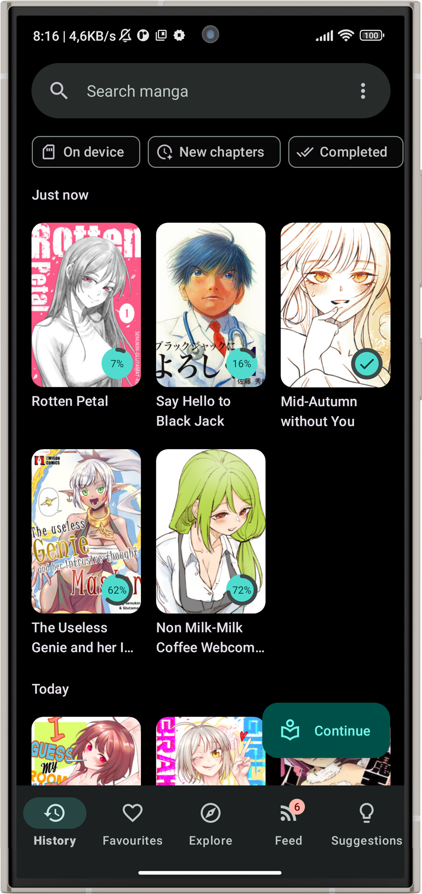
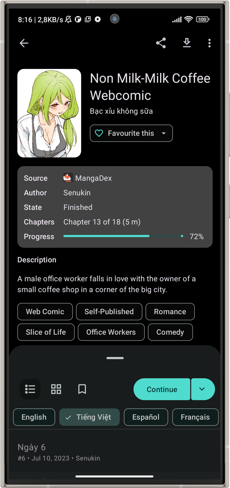
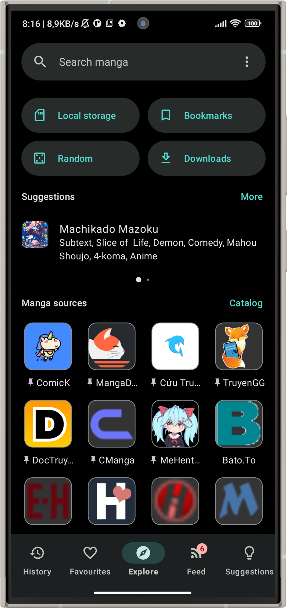
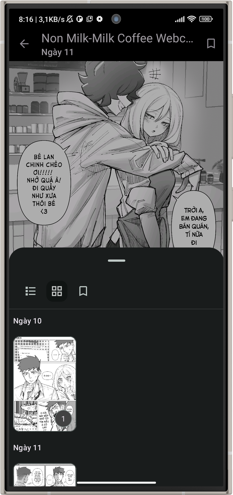
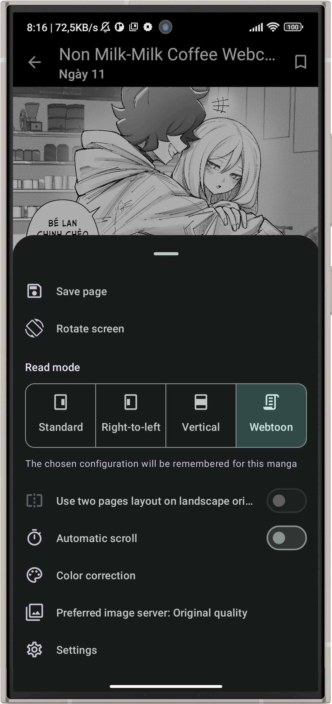
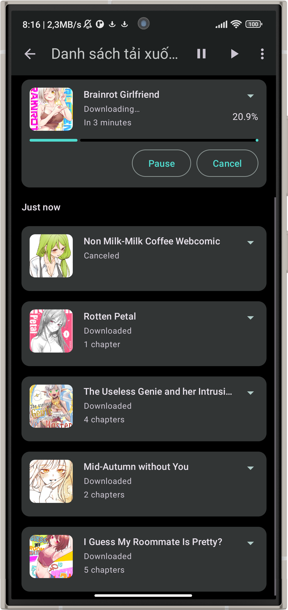
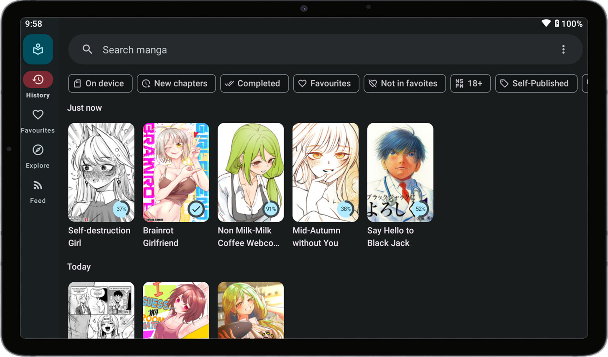
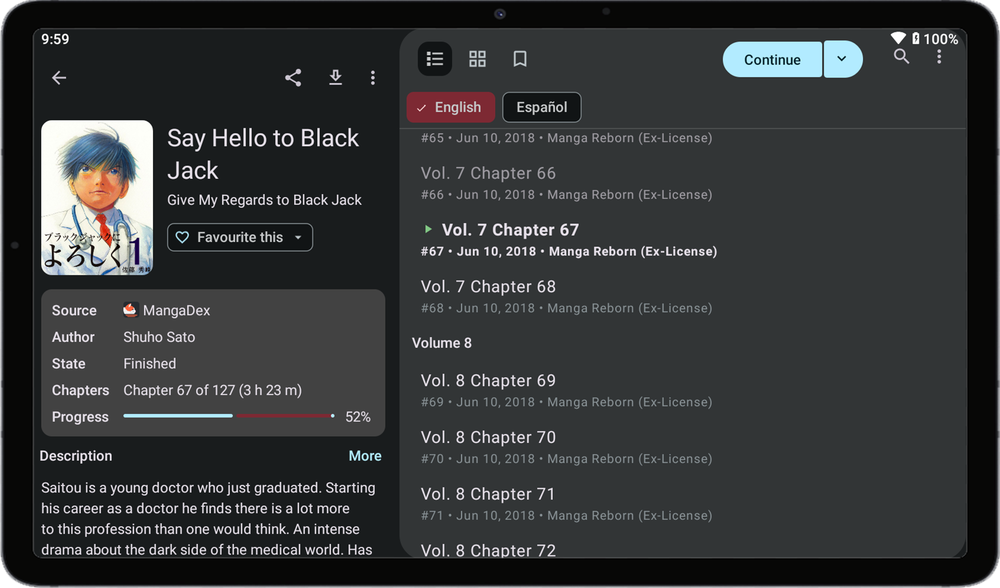

# [Kotatsu](https://kotatsu.app)

**[Kotatsu](https://github.com/KotatsuApp/Kotatsu) is a free and open-source manga reader for Android with built-in online content sources.**

     

### Download

* **Recommended:** Download and install APK from [GitHub Releases](https://github.com/KotatsuApp/Kotatsu/releases/latest). Application has a built-in self-updating feature.
* Get it on [F-Droid](https://f-droid.org/packages/org.koitharu.kotatsu). The F-Droid build may be a bit outdated and some fixes might be missing.
* Also [nightly builds](https://github.com/KotatsuApp/Kotatsu-nightly/releases) are available (very unstable, use at your own risk).

### Main Features

* Online [manga catalogues](https://github.com/KotatsuApp/kotatsu-parsers)
* Search manga by name, genres, and more filters
* Reading history and bookmarks
* Favorites organized by user-defined categories
* Downloading manga and reading it offline. Third-party CBZ archives also supported!
* Tablet-optimized Material UI
* Standard and Webtoon-optimized customizable reader
* Notifications about new chapters with updates feed
* Integration with manga tracking services: Shikimori, AniList, MyAnimeList, Kitsu
* Password / fingerprint-protected access to the app

### In-App Screenshots

    
    
    
    
    
    

 

    
    

### Localization

**[Kotatsu](https://github.com/KotatsuApp/Kotatsu) is localized in a number of different languages.** 
**📌 If you would like to help improve these or add new languages,
please head over to the [Weblate project page](https://hosted.weblate.org/engage/kotatsu/)**

### Contributing

 

 

**📌 Pull requests are welcome, if you want: See [CONTRIBUTING.md](https://github.com/KotatsuApp/Kotatsu/blob/devel/CONTRIBUTING.md) for the guidelines**

### License

You may copy, distribute and modify the software as long as you track changes/dates in source files. Any modifications to or software including (via compiler) GPL-licensed code must also be made available under the GPL along with build & install instructions.

### DMCA disclaimer

The developers of this application do not have any affiliation with the content available in the app. It collects content from sources that are freely available through any web browser.

