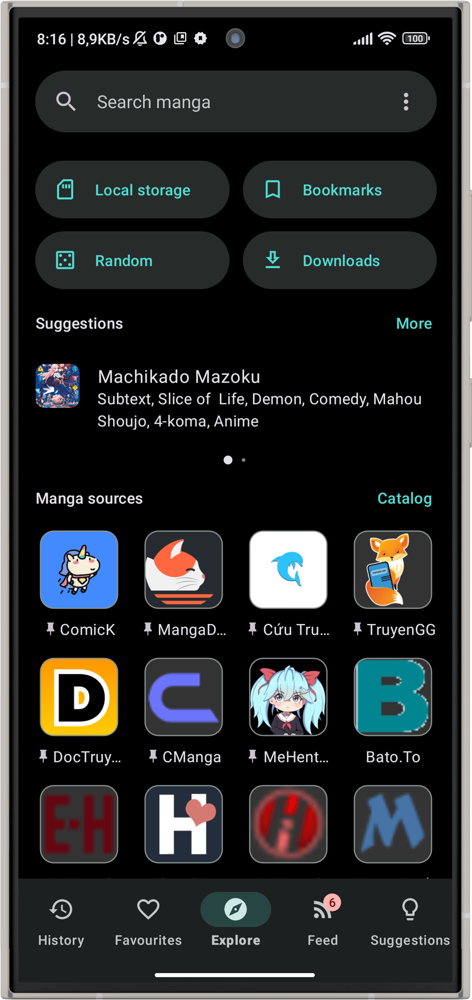
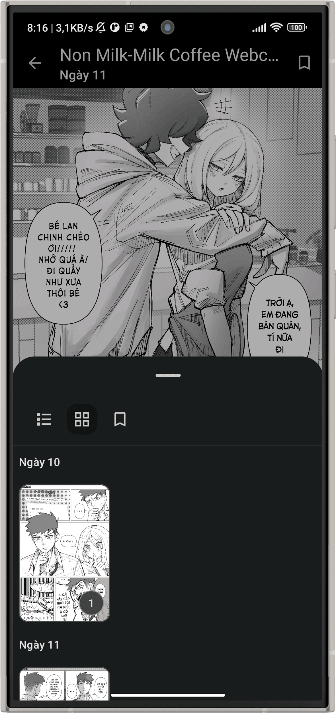
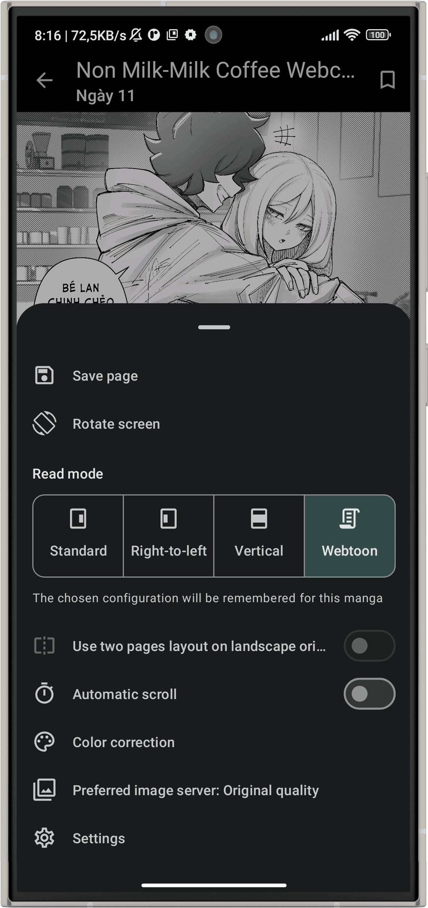

# [Kotatsu](https://kotatsu.app)

**[Kotatsu](https://github.com/vtorres-t/Kotatsu) is a free and open-source manga reader for Android with built-in online content sources.**

    

### Download

* **Recommended:** Download and install APK from [GitHub Releases](https://github.com/vtorres-t/Kotatsu/releases/latest). Application has a built-in self-updating feature.

### Main Features

* Online [manga catalogues](https://github.com/vtorres-t/kotatsu-parsers) (with 1200+ manga sources)
* Search manga by name, genres and more filters
* Favorites organized by user-defined categories
* Reading history, bookmarks and incognito mode support
* Download manga and read it offline. Third-party CBZ archives are also supported
* Clean and convenient Material You UI, optimized for phones, tablets and desktop
* Standard and Webtoon-optimized customizable reader, gesture support on reading interface
* Notifications about new chapters with updates feed, manga recommendations (with filters)
* Integration with manga tracking services: Shikimori, AniList, MyAnimeList, Kitsu
* Password / fingerprint-protected access to the app
* Automatically sync app data with other devices on the same account
* Support for older devices running Android 5.0+

### In-App Screenshots

    
    
    
    
    
    

 

    
    

### Contributing

 

<a href="https://github.com/vtorres-t/Kotatsu">
  <picture>
    <source srcset="https://github-readme-stats.vercel.app/api/pin/?username=vtorres-t&repo=Kotatsu&bg_color=0d1117&text_color=1976d2&title_color=1976d2&icon_color=0877d2&border_radius=10&description_lines_count=2&show_owner=true" media="(prefers-color-scheme: dark)">
    
  </picture>
</a>
<a href="https://github.com/vtorres-t/Kotatsu-parsers">
  <picture>
    <source srcset="https://github-readme-stats.vercel.app/api/pin/?username=vtorres-t&repo=Kotatsu-parsers&bg_color=0d1117&text_color=1976d2&title_color=1976d2&icon_color=0877d2&border_radius=10&description_lines_count=2&show_owner=true" media="(prefers-color-scheme: dark)">
    
  </picture>
</a> 

 

### License

You may copy, distribute and modify the software as long as you track changes/dates in source files. Any modifications to or software including (via compiler) GPL-licensed code must also be made available under the GPL along with build & install instructions.

### DMCA disclaimer

The developers of this application do not have any affiliation with the content available in the app. It collects content from sources that are freely available through any web browser.

