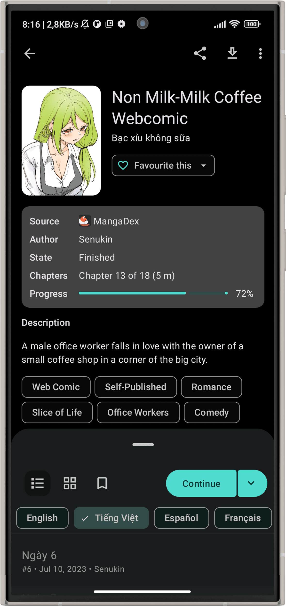
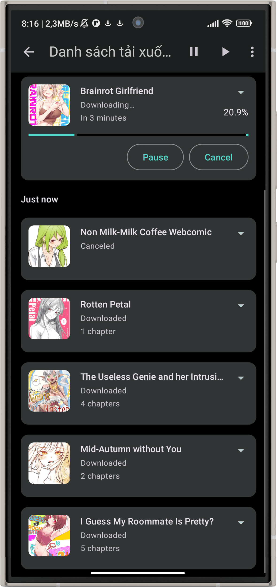
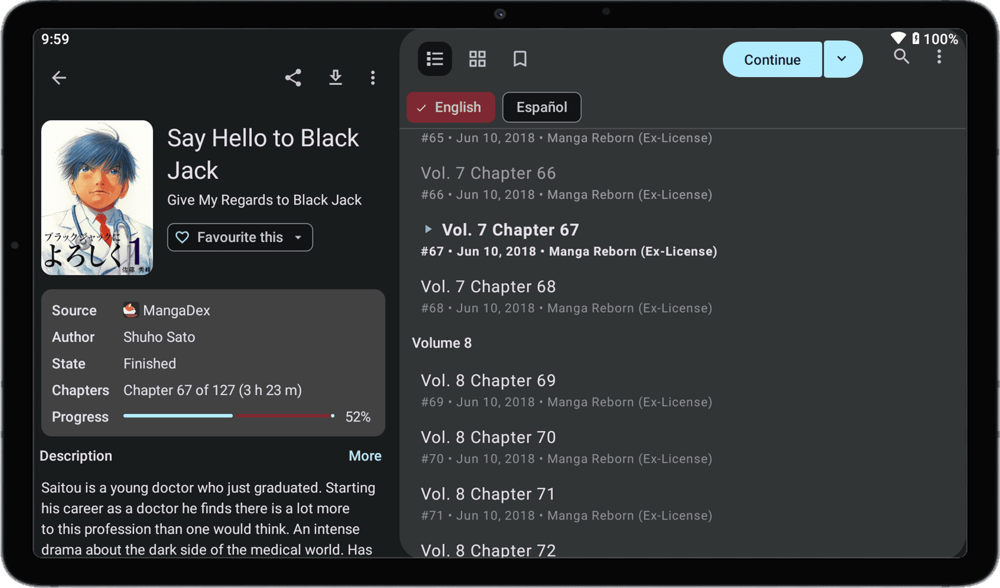

<div align="center">

<a href="https://kotatsu.app">
    
</a>

# [Kotatsu](https://kotatsu.app)

**[Kotatsu](https://github.com/KotatsuApp/Kotatsu) is a free and open-source manga reader for Android with built-in online content sources.**

   [](https://github.com/KotatsuApp/kotatsu-parsers) [](https://hosted.weblate.org/engage/kotatsu/) [](https://discord.gg/NNJ5RgVBC5) [](https://t.me/kotatsuapp) [](https://github.com/KotatsuApp/Kotatsu/blob/devel/LICENSE)

### Download

<div align="left">

* **Recommended:** Download and install APK from [GitHub Releases](https://github.com/KotatsuApp/Kotatsu/releases/latest). Application has a built-in self-updating feature.
* Get it on [F-Droid](https://f-droid.org/packages/org.koitharu.kotatsu). The F-Droid build may be a bit outdated and some fixes might be missing.
* Also [nightly builds](https://github.com/KotatsuApp/Kotatsu-nightly/releases) are available (Unstable, use at your own risk). Application has a built-in self-updating feature.

</div>

### Main Features

<div align="left">

* Online [manga catalogues](https://github.com/KotatsuApp/kotatsu-parsers) (with 1200+ manga sources)
* Search manga by name, genres and more filters
* Favorites organized by user-defined categories
* Reading history, bookmarks and incognito mode support
* Download manga and read it offline. Third-party CBZ archives are also supported
* Clean and convenient Material You UI, optimized for phones, tablets and desktop
* Standard and Webtoon-optimized customizable reader, gesture support on reading interface
* Notifications about new chapters with updates feed, manga recommendations (with filters)
* Integration with manga tracking services: Shikimori, AniList, MyAnimeList, Kitsu
* Password / fingerprint-protected access to the app
* Automatically sync app data with other devices on the same account
* Support for older devices running Android 6.0+

</div>

### In-App Screenshots

<div align="center">
    
    
    
    
    
    
</div>

<br>

<div align="center">
    
    
</div>

### Localization

<a href="https://hosted.weblate.org/engage/kotatsu/">

</a>

**[Kotatsu](https://github.com/KotatsuApp/Kotatsu) is localized in a number of different languages.**<br>
**📌 If you would like to help improve these or add new languages,
please head over to the [Weblate project page](https://hosted.weblate.org/engage/kotatsu/)**

### Contributing

<br>

<a href="https://github.com/KotatsuApp/Kotatsu">
  <picture>
    <source srcset="https://github-readme-stats.vercel.app/api/pin/?username=KotatsuApp&repo=Kotatsu&bg_color=0d1117&text_color=1976d2&title_color=1976d2&icon_color=0877d2&border_radius=10&description_lines_count=2&show_owner=true" media="(prefers-color-scheme: dark)">
    
  </picture>
</a>
<a href="https://github.com/KotatsuApp/Kotatsu-parsers">
  <picture>
    <source srcset="https://github-readme-stats.vercel.app/api/pin/?username=KotatsuApp&repo=Kotatsu-parsers&bg_color=0d1117&text_color=1976d2&title_color=1976d2&icon_color=0877d2&border_radius=10&description_lines_count=2&show_owner=true" media="(prefers-color-scheme: dark)">
    
  </picture>
</a><br></br>

</br>

**📌 Pull requests are welcome, if you want: See [CONTRIBUTING.md](https://github.com/KotatsuApp/Kotatsu/blob/devel/CONTRIBUTING.md) for the guidelines**

### Certificate fingerprints

```plaintext
2C:19:C7:E8:07:61:2B:8E:94:51:1B:FD:72:67:07:64:5D:C2:58:AE
```

```plaintext
67:E1:51:00:BB:80:93:01:78:3E:DC:B6:34:8F:A3:BB:F8:30:34:D9:1E:62:86:8A:91:05:3D:BD:70:DB:3F:18
```

### License

[](http://www.gnu.org/licenses/gpl-3.0.en.html)

<div align="left">

You may copy, distribute and modify the software as long as you track changes/dates in source files. Any modifications to or software including (via compiler) GPL-licensed code must also be made available under the GPL along with build & install instructions.

</div>

### DMCA disclaimer

<div align="left">

The developers of this application do not have any affiliation with the content available in the app and does not store or distribute any content. This application should be considered a web browser, all content that can be found using this application is freely available on the Internet. All DMCA takedown requests should be sent to the owners of the website where the content is hosted.

</div>
